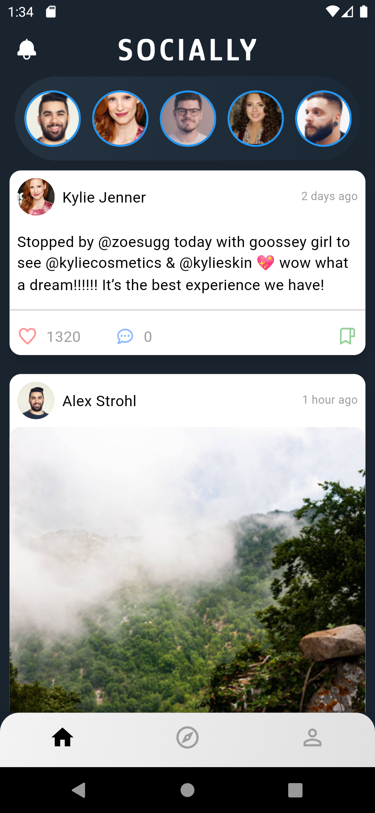
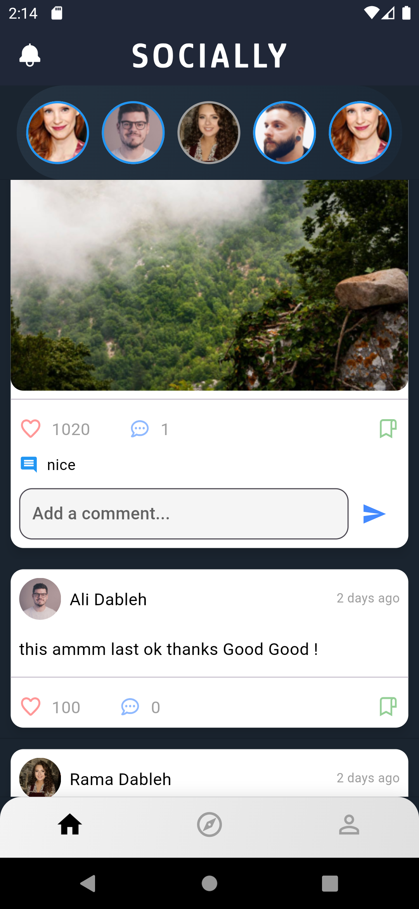
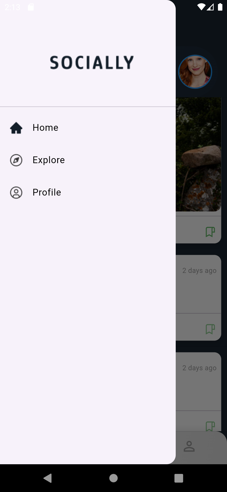

# social_media_app
The available version of the application in the project is in .aab format because the APK version requires a different Gradle version
## Getting Started

This project is a starting point for a Flutter application.

A few resources to get you started if this is your first Flutter project:

- [Lab: Write your first Flutter app](https://docs.flutter.dev/get-started/codelab)
- [Cookbook: Useful Flutter samples](https://docs.flutter.dev/cookbook)

For help getting started with Flutter development, view the
[online documentation](https://docs.flutter.dev/), which offers tutorials,
samples, guidance on mobile development, and a full API reference.

## Screenshots
the home page 
The stories in your mobile social media application will appear blue before being viewed and gray after they are viewed. This color change will help users distinguish between seen and unseen stories easily.

add a comment

Side Screen

Stories

